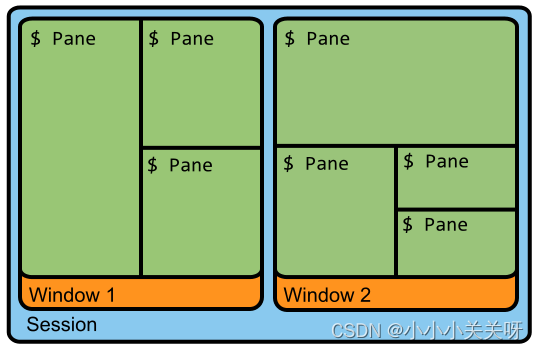

tmux是一种比screen更加强大的终端复用工具。如果需要简单上手的终端复用工具可以参考：[screen教程](https://blog.csdn.net/qq_39280836/article/details/117481883?ops_request_misc=%257B%2522request%255Fid%2522%253A%2522166401554016782427468615%2522%252C%2522scm%2522%253A%252220140713.130102334.pc%255Fblog.%2522%257D&request_id=166401554016782427468615&biz_id=0&utm_medium=distribute.pc_search_result.none-task-blog-2~blog~first_rank_ecpm_v1~rank_v31_ecpm-1-117481883-null-null.nonecase&utm_term=screen&spm=1018.2226.3001.4450)。
## 会话&窗口&窗格
**会话（session）**：命令行的典型使用方式是，打开一个终端窗口，在里面输入命令。用户与计算机的这种临时的交互，称为一次"会话" 。
**窗口（window）**：窗口是终端提供给会话来执行命令的交互界面。
会话的一个重要特点是，窗口与其中启动的进程是连在一起的。打开窗口，会话开始；关闭窗口，会话结束，会话内部的进程也会随之终止，不管有没有运行完。为了解决这个问题，tmux将会话与窗口"解绑"：当窗口关闭时，会话并不终止，而是继续运行，等到以后需要的时候，再让会话"绑定"其他窗口。
**窗格（pane）**：在开发中可能需要同时使用vim编辑文件，同时执行程序、观察资源利用状态等等，此时tmux可以将窗口拆分成为一个个小窗格分别用于同时可视化地执行多种任务。


## 会话操作
Tmux 窗口有大量的快捷键。所有快捷键都要通过前缀键唤起。默认的前缀键是Ctrl+b，即先按下Ctrl+b，快捷键才会生效。

举例来说，帮助命令的快捷键是Ctrl+b ?。它的用法是，在 Tmux 窗口中，先按下Ctrl+b，再按下?，就会显示帮助信息。然后，按下 ESC 键或q键，就可以退出帮助。
一些常用命令如下：

```shell
# 新建会话
tmux new -s <session-name>
# 分离会话
tmux attach
# 查看现有会话
tmux ls
tmux list-session
# 重新接入会话
tmux attach -t <session-name>
# 杀死会话
tmux kill-session -t <session-name>
# 切换会话
tmux switch -t <session-name>
# 重命名会话
tmux rename-session -t <old-name> <new-name>
```
**快捷键**：
Ctrl+b d：分离当前会话。
Ctrl+b s：列出所有会话。
Ctrl+b $：重命名当前会话。
## 窗口操作
```shell
## 新建窗口
tmux new-window
# 新建一个指定名称的窗口
tmux new-window -n <window-name>

## 切换窗口
# 切换到指定编号的窗口
tmux select-window -t <window-number>
# 切换到指定名称的窗口
tmux select-window -t <window-name>

## 重命名窗口
tmux rename-window <new-name>
```
**快捷键**：
Ctrl+b c：创建一个新窗口，状态栏会显示多个窗口的信息。
Ctrl+b p：切换到上一个窗口（按照状态栏上的顺序）。
Ctrl+b n：切换到下一个窗口。
Ctrl+b <number>：切换到指定编号的窗口，其中的<number>是状态栏上的窗口编号。
Ctrl+b w：从列表中选择窗口。
Ctrl+b ,：窗口重命名。
## 窗格操作
```shell
## 窗格划分
# 划分上下两个窗格
tmux split-window
# 划分左右两个窗格
tmux split-window -h

## 光标移动
# 光标切换到上方窗格
$ tmux select-pane -U
# 光标切换到下方窗格
$ tmux select-pane -D
# 光标切换到左边窗格
$ tmux select-pane -L
# 光标切换到右边窗格
$ tmux select-pane -R

## 窗格移动
# 当前窗格上移
tmux swap-pane -U
# 当前窗格下移
tmux swap-pane -D
```
**快捷键**
Ctrl+b %：划分左右两个窗格。
Ctrl+b "：划分上下两个窗格。
Ctrl+b <arrow key>：光标切换到其他窗格。<arrow key>是指向要切换到的窗格的方向键，比如切换到下方窗格，就按方向键↓。
Ctrl+b ;：光标切换到上一个窗格。
Ctrl+b o：光标切换到下一个窗格。
Ctrl+b {：当前窗格与上一个窗格交换位置。
Ctrl+b }：当前窗格与下一个窗格交换位置。
Ctrl+b Ctrl+o：所有窗格向前移动一个位置，第一个窗格变成最后一个窗格。
Ctrl+b Alt+o：所有窗格向后移动一个位置，最后一个窗格变成第一个窗格。
Ctrl+b x 或者 Ctrl+d：关闭当前窗格。
Ctrl+b !：将当前窗格拆分为一个独立窗口。
Ctrl+b z：当前窗格全屏显示，再使用一次会变回原来大小。
Ctrl+b Ctrl+<arrow key>：按箭头方向调整窗格大小。
Ctrl+b q：显示窗格编号。
## 建议
- 尽量多使用快捷键替代命令，快捷键也可以通过修改配置文件自定义
- 可根据个人习惯同时开多窗格和多窗口进行高效开发

**参考**：
- [阮一峰Tmux使用教程](http://www.ruanyifeng.com/blog/2019/10/tmux.html)
- [Tmux: Productive Mouse-Free Development](https://pityonline.gitbooks.io/tmux-productive-mouse-free-development_zh/content/index.html)
- [Tmux使用手册](http://louiszhai.github.io/2017/09/30/tmux/)
- [知乎视频：手把手教你使用终端复用神器 Tmux](https://zhuanlan.zhihu.com/p/43687973)
