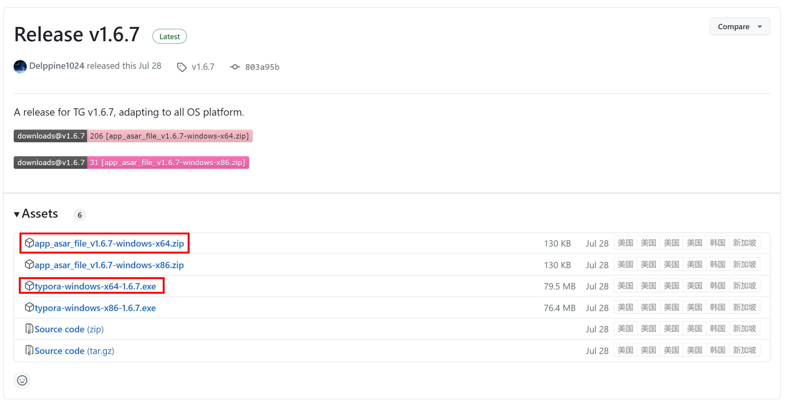

### Typora下载

下载地址：https://github.com/Delppine1024/TGreen

下载红框标注文件。其中第一个是激活文件，解压缩后移动到typora安装路径下 resources 文件下下替换激活

### 输出html将图像转成base64

typora原生不支持导出到html包含图像，通过将图像转成base64嵌入

网上有人对此做了相关工作：https://meta.appinn.net/t/topic/25788
点击下载[可执行文件](https://github.com/EdenHell/compact_html/releases/download/v1.1/compact_html.exe)

##### 配置typora

修改偏好设置，如下所示，自定义命令根据实际情况替换可执行文件的地址，下面使用的地址是"D:\SoftWare\compact_html.exe" "${outputPath}"

