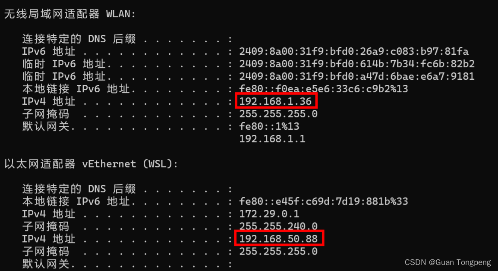
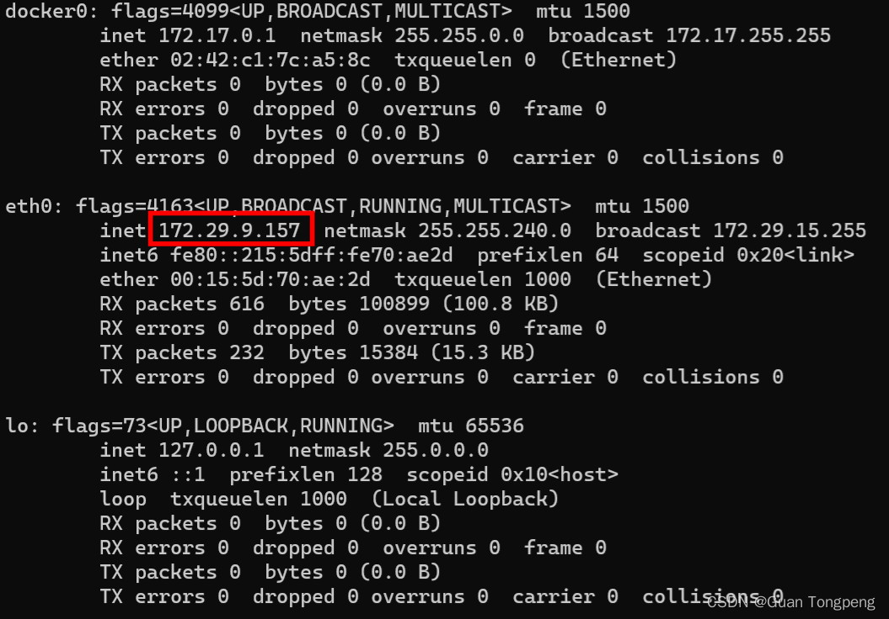
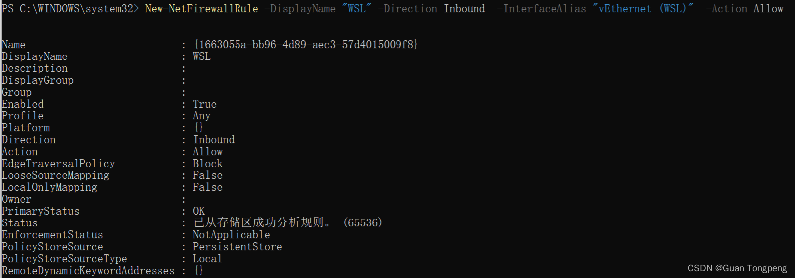
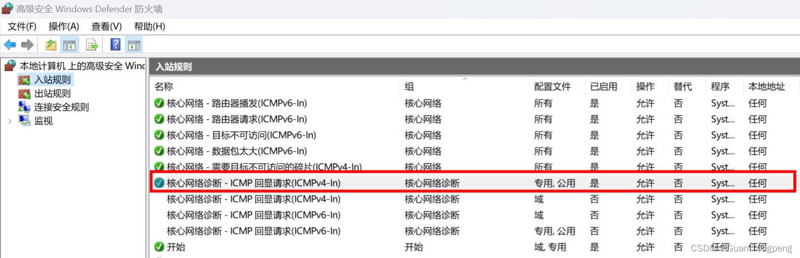

### 查看wsl与主机ip
windows主机ip查看命令`ipconfig`，wsl查看命令`ifconfig`
主机ip地址如下：

wsl ip地址如下：

我们的目标是使得主机端能够访问wsl ip，并且wsl能够访问主机ip，这里使用`ping`命令
一般情况下，主机端访问wsl ip没有问题（在主机端`ping 172.29.9.157`），但是wsl访问主机端可能不行（在wsl中`ping 172.29.0.1`)，原因是被防火墙阻止了。

### 1.设置主机防火墙允许wsl访问
使用管理员权限打开powershell，输入命令：
```shell
New-NetFirewallRule -DisplayName "WSL" -Direction Inbound  -InterfaceAlias "vEthernet (WSL)"  -Action Allow
```
得到结果如下：

此时再`ping 172.29.0.1`主机ip即可通过。
但是`ping`主机局域网ip不通`ping 192.168.1.36`

### 2.修改防火墙入站规则
在防火墙高级安全中启动如下入栈规则，之后就可以`ping 192.168.1.36`通过


### 3.配置一键代理脚本

```shell
#!/bin/sh
export hostip=$(cat /etc/resolv.conf | grep nameserver | awk '{ print $2 }') # 获取 windows 和 wsl 所在虚拟局域网环境下 windows 的 IP 地址 
wslip=$(hostname -I | awk '{print $1}') # 获取 windows 和 wsl 所在虚拟局域网环境下 wsl ubuntu 22.04 的 IP 地址
port=7890 # windows 代理软件的访问端口，clash 的一般是 7890，使用 v2ray 等其他软件需要修改此项
 
PROXY_HTTP="http://${hostip}:${port}"
 
set_proxy(){
  export http_proxy="${PROXY_HTTP}"
  export HTTP_PROXY="${PROXY_HTTP}"
 
  export https_proxy="${PROXY_HTTP}"
  export HTTPS_proxy="${PROXY_HTTP}"
 
  export ALL_PROXY="${PROXY_SOCKS5}"
  export all_proxy=${PROXY_SOCKS5}
 
  git config --global http.https://github.com.proxy ${PROXY_HTTP}
  git config --global https.https://github.com.proxy ${PROXY_HTTP}
 
  echo "Proxy has been opened: $PROXY_HTTP"
}
 
unset_proxy(){
  unset http_proxy
  unset HTTP_PROXY
  unset https_proxy
  unset HTTPS_PROXY
  unset ALL_PROXY
  unset all_proxy
  git config --global --unset http.https://github.com.proxy
  git config --global --unset https.https://github.com.proxy
 
  echo "Proxy has been closed."
}
 
test_setting(){
  echo "Host IP:" ${hostip}
  echo "WSL IP:" ${wslip}
  echo "Try to connect to Google..."
  resp=$(curl -I -s --connect-timeout 5 -m 5 -w "%{http_code}" -o /dev/null www.google.com)
  if [ ${resp} = 200 ]; then
    echo "Proxy setup succeeded!"
  else
    echo "Proxy setup failed!"
  fi
}
 
if [ "$1" = "set" ]
then
  set_proxy
 
elif [ "$1" = "unset" ]
then
  unset_proxy
 
elif [ "$1" = "test" ]
then
  test_setting
else
  echo "Unsupported arguments."
fi
```
要注意的是需要修改端口`port=7890`改为你设置的端口，假如你新建上述脚本命名为proxy.sh，保存在~目录下，在`.bashrc`底部添加即可启动wsl自动配置代理
```shell
# set proxy
source ~/proxy.sh set
```
